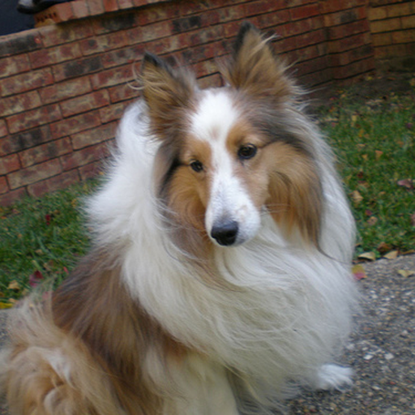

## ControlNet for Low-level Vision
* ControlNet works well for high-level control such as segmentation to image, pose to image. 
* However, ControlNet struggles for low-level control, such as super-resolution.
* In this repo, we present an inference approach that integrate Diffusion Posterior Sampling (DPS) for low-level ControlNet. Combining ControlNet with DPS, we significantly enhance the performance for both approaches.
* It works pretty well, for example
* The source image
* 
* The downsample x8 image
* 
* The super-resolution x8 image
* 
* The downsample x8 of super resolution x8 image. It looks the same as the input downsample x8 image
* 


* The repo is implemented in diffusers flavor.

## Quick Start
```bash
python main_sd2cn.py --data ./examples/src --out ./examples/out --cnmodel xutongda/control_e_sd2.0_srx8
```

## Current Supported Models
* super resolution x8, in https://huggingface.co/xutongda/control_e_sd2.0_srx8